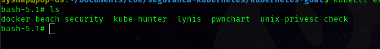

## Terceiro desafio:
**"SSRF in the Kubernetes world"**

Esse cenário demonstra uma vulnerabilidade bastante popular que está sendo exploradas em cloud, o [SSRF (Server Side Request Forgery)](https://portswigger.net/web-security/ssrf). Nesse cenário, veremos como explorar essa vulnerabilidade para obter acesso a metadados de instância em cloud, assim também como informações de serviços internos.


Acessamos o endpoint `http://127.0.0.1:1232`:


O objetivo desse desafio é obter o valor da secret k8s-goat

Informações disponibilizadas:

Em cloud, o ip 169.254.169.254 é um endereço configurado IPv4 local configurado dinamicamente. A maioria dos provedores de nuvem utiliza esse endereço para fornecer os metadados para as instâncias, semelhante ao servicename.svc.cluster.local em clusters kubernetes internos.

Podemos começar com a técnica de enumeração e reconhecimento para entender quais serviços estão rodando na instância atual, também podemos consultar o container/pod atual para ver se há outros serviços em execução, consultando as diferentes portas e endereços. Vamos consultar a porta 5000 desse container, utilizando o método GET:


Como podemos ver, ele está executando algum serviço web e também retornou uma respota HTTP. Agora temos mais dados e informações para avançar nosso ataque e obter mais acesso dentro da rede kubernetes.
Existe um service interno chamado metadata-db, vamos ver se conseguimos obter mais informações dele.


Ao enumerarmos todos as chaves, finalmente conseguimos ver que existe uma flag em http://metadata-db/latest/secrets/kubernetes-goat


Obtemos a secret `azhzLWdvYXQtY2E5MGVmODVkYjdhNWFlZjAxOThkMDJmYjBkZjljYWI=`, como está codificada em [base64](https://developer.mozilla.org/en-US/docs/Glossary/Base64), podemos decodificar facilmente:

``` bash
echo "azhzLWdvYXQtY2E5MGVmODVkYjdhNWFlZjAxOThkMDJmYjBkZjljYWI=" | base64 -d
```

Assim obtendo a secret, `k8s-goat-ca90ef85db7a5aef0198d02fb0df9cab`


## Quarto desafio:
**"Container escape to the host system"**

Este cenário demonstra erros de configuração comuns e um dos problemas de segurança propensos a erros no Kubernetes e ambientes de container em geral - conceder privilégios desnecessários. Porém, esse cenário também pode ser aplicado a outros sistemas e serviço. Neste exemplo, usaremos container para obter acesso ao sistema host.
A maior parte do software de monitoramento, tracing e debugging requer privilégios e recursos extras para ser executado. Neste cenário, você verá um pod com recursos e privilégios extras, incluindo HostPath, permitindo explorar o cluster comprometido.

Missão: Obter acesso ao sistema host e obter o kubeconfig em /var/lib/kubelet/kubeconfig, assim explorando os nodes do kubernetes

Acessamos esse desafio em `http://127.0.0.1:1233`


Após realizar a análise, você pode identificar que este contêiner possui privilégios totais do sistema host e permite escalonamento de privilégios. Assim como /host-system está montado.


Podemos explorar o file-system navegando até o repositório /host-system


Podemos obter acesso ao host utilizando o comando `chroot`

``` bash
chroot /host-system bash
```

Agora podemos acessar todos os sistemas do host, como containers, configurações, etc.

O kubeconfig pode ser encontrado no caminho padrão /etc/kubernetes (ou em /var/lib/kubernetes), que é usado pelo kubelet para se comunicar com o servidor API do Kubernetes.


Podemos acessar os recursos do cluster passando esse kubeconfig como parâmetro:

``` bash
kubectl --kubeconfig /etc/kubernetes/kubelet.conf get nodes
```


## Quinto desafio:

**"Docker CIS benchmarks analysis"**

Esse desafio, basicamente, é simples, porém muito utilizado em auditorias de segurança. Aqui aprenderemos a utilizar ferramentas de [cis benchmark](https://www.cisecurity.org/cis-benchmarks) em container e usar os resultados para exploração adicional ou correção de configurações incorretas e vulnerabilidades, tanto para a correção ou alguma exploração adicional, varrendo desde configurações incorretas à vulnerabilidades.
Este cenário serve principalmente para realizar a análise de benchmarks nos nós do Kubernetes para identificar as possíveis vulnerabilidades de segurança.
Para iniciar esse cenário, rodaremos um pod com graves erros de segurança, executando:

``` bash
kubectl apply -f scenarios/docker-bench-security/deployment.yaml
```


Em seguida entraremos nesse pod:

``` bash
kubectl exec -it docker-bench-security-jkv6m -- bash
```



Ao rodar o comando "ls", vemos um diretório do "docker-bench-security", ele contém o [executável](https://github.com/docker/docker-bench-security) necessário para esse scan, simplesmente rodamos o executável:

``` bash
sh docker-bench-security.sh
```

Após alguns segudos, vemos no output as vulnerabilidades encontrados no node. 


Recomendo fortemente que vocês [estudem essa ferramenta](https://github.com/docker/docker-bench-security) para verificar todas as possibilidades encontradas nela.