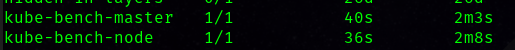
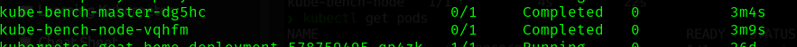
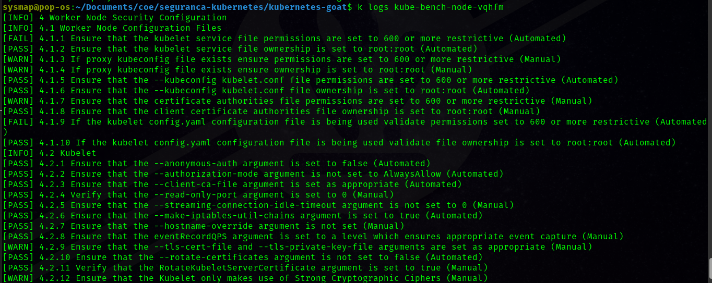
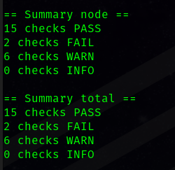
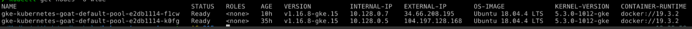
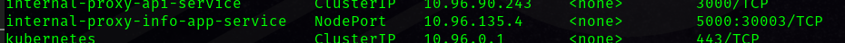
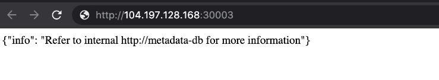
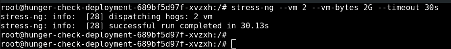
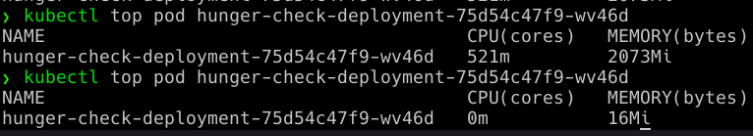

## Sexto desafio:
**"Kubernetes CIS benchmarks analysis"**
Esse cenário proposto é muito útil na realização de auditorias e verificações de segurança no kubernetes. Aqui, como no desafio anterior, utilizaremos ferramentas de [cis benchmark](https://www.cisecurity.org/cis-benchmarks), porém no cluster kubernetes, utilizando os resultados para explorações adicionais ou correção de vulnerabilidades.

Dica: recomendo fortemente ler a documentação do [kube-bench](https://github.com/aquasecurity/kube-bench) para melhor entendimento desse cenário.

Para iniciar esse desafio, iremos rodar os [jobs](https://kubernetes.io/docs/concepts/workloads/controllers/job/) de cis benchmark utilizando os comandos:

``` bash
kubectl apply -f scenarios/kube-bench-security/node-job.yaml
kubectl apply -f scenarios/kube-bench-security/master-job.yaml
```
Após aplicar, listaremos os jobs com o comando `kubectl get jobs`:



Com o comando `kubectl get pods` conseguimos ver que foram criados pods referente aos jobs:



Vamos ler os logs:




Como podemos observar, o kube-bench analisa o cluster e nos mostra as possíveis falhas e brechas de segurança, baseado na documentação da [cis](https://www.cisecurity.org/benchmark/kubernetes), cabe a equipe de infraestrutura e segurança analisar os logs e fazer as correções necessárias para tornar o ambiente mais seguro.


## Setimo desafio:
**"NodePort exposed services"**

Nesse cenário, veremos outra configuração incorreta que pode dar aos invasores acesso a serviços internos e a serviços não expostos. Esta é uma das configurações incorretas mais simples feitas ao criar os serviços Kubernetes e também na instalação e configurações do cluster.

Se algum dos usuários expõe qualquer serviço dentro do cluster Kubernetes com ![NodePort}(https://kubernetes.io/docs/concepts/services-networking/service/#type-nodeport), isso significa que os nós onde os clusters Kubernetes estão em execução não têm nenhuma segurança de firewall/rede habilitada. Precisamos ver alguns serviços não autenticados e não autorizados.

Para começar esse desafio, rodamos o seguinte comando para ver o ip externo dos nodes:

``` bash
kubectl get nodes -o wide
```



Ao identificarmos o ip externo, checaremos se algum service está rodando como node-port:
``` bash
kubectl get services
```



Uma vez identificado que há um NodePort exposto, podemos apenas verificar conectando-o e acessando-o
``` bash
nc -zv IP-EXTERNO 30003
```



Caso seja necessário manter o service como nodeport, é recomendado adicionar regras de segurança para impedir o acesso indesejado


## Oitavo desafio:
**"DoS the Memory/CPU resources"**

Disponibilidade é uma das tríades da [CIA](https://www.institutedata.com/blog/cia-in-cyber-security/#:~:text=Availability%2C%20the%20final%20component%20of,backups%20to%20prevent%20data%20loss.). Um dos principais problemas resolvidos pelo Kubernetes é o gerenciamento de recursos como auto-scaling, implementações, etc. Nesse cenário, veremos como os invasores podem aproveitar e obter acesso a mais recursos ou causar impacto na disponibilidade dos recursos executando o DoS (Denial of Service) se não houvesse configurações de gerenciamento de recursos implementadas nos recursos do cluster, como solicitações e limites de memória e CPU.
Caso não haja [especificação de recursos](https://kubernetes.io/docs/concepts/configuration/manage-resources-containers/) nos manifestos do Kubernetes e nenhum intervalo de limites aplicado aos contêineres. Como invasor, podemos consumir todos os recursos onde o pod/implantação está em execução e privar outros recursos e causar um DoS para o ambiente.
Para iniciar esse cenário, acessamos `http://127.0.0.1:1236/`
Este pod não definiu nenhum limite de recursos nos manifestos do Kubernetes. Assim, podemos realizar facilmente uma série de operações que podem consumir mais recursos, podemos utilizar ferramentas simples, como `stress-ng` para sobrecasrregar os recursos, podendo assim derrumar serviços.

Observação:
Este ataque pode não funcionar em alguns casos, como auto-scaling, restrições de recursos, etc. Porém, pode causar mais danos quando o auto-scaling está habilitado e criando mais recursos e gerando contas mais caras para o provedor de nuvem ou impactando a disponibilidade dos recursos e Serviços.

Ao acessarmos a url em questão, rodamos o seguinte comando:
``` bash
stress-ng --vm 2 --vm-bytes 2G --timeout 30s
```


Você pode ver a diferença entre o consumo normal de recursos e a execução do stress-ng, onde ele consome muitos recursos do que pretendia consumir

